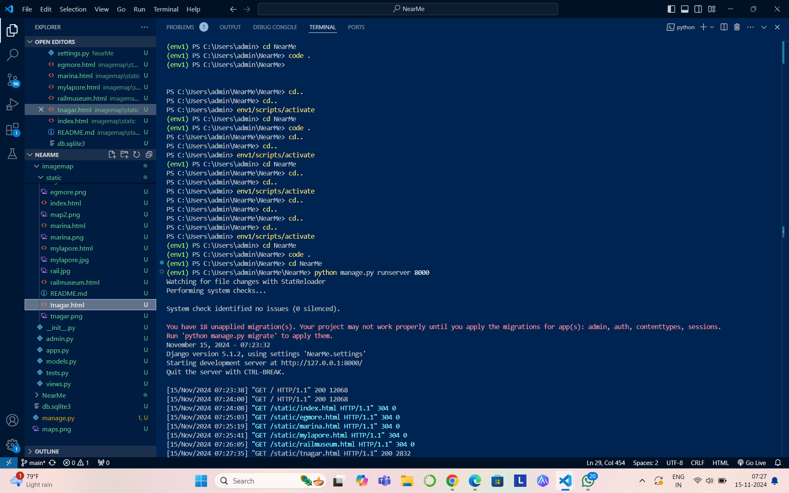

# Ex04 Places Around Me
## Date: 15-11-2024

## AIM
To develop a website to display details about the places around my house.

## DESIGN STEPS

### STEP 1
Create a Django admin interface.

### STEP 2
Download your city map from Google.

### STEP 3
Using ```<map>``` tag name the map.

### STEP 4
Create clickable regions in the image using ```<area>``` tag.

### STEP 5
Write HTML programs for all the regions identified.

### STEP 6
Execute the programs and publish them.

## CODE
index.html
```<html>
<head>
    <title>Chennai</title>
</head>
<body bgcolor="ffffff">

    <table align="center" width="100%" bgcolor="#0077b6">
        <tr>
            <td align="center">
                <h1><font color="white">Chennai</font></h1>
                <b><font color="white">A Tapestry of Tradition, Heartfelt Connections, and Timeless Charm</font></b>
             <b><font color="white"> - Preethi D (24007817)</b></td></font>
            </td>
        </tr>
    </table>
    <hr>
       

<map name="image-map">
    <area target="" alt="" title="" href="egmore.html" coords="928,487,1116,591" shape="rect">
    <area target="" alt="" title="" href="marina.html" coords="1097,612,1317,703" shape="rect">
    <area target="" alt="" title="" href="mylapore.html" coords="996,709,1124,780" shape="rect">
    <area target="" alt="" title="" href="railmuseum.html" coords="471,306,772,413" shape="rect">
    <area target="" alt="" title="" href="tnagar.html" coords="769,672,950,767" shape="rect">
    
</map>
    

</body>
</html>
```
egmore.html
```
<html>
<head>
  <title>egmore</title>
</head>
<body>
    <body bgcolor="#E1E8ED"></body>
    <h1 align="center">
        <font color=black><b> Egmore
            </b></font>
        </h1>
        <h3 align="center">
        <font color=black><b> A Blend of History and Modernity -
 Exploring the Heritage and Vibrancy of One of Chennai's Iconic Neighborhoods
             </b></font></h3>
        <hr size="3" color=black>
        
          <table width="100%" height="70%">
            <tr style="height: 60vh;">
              <td width="50%" style="background-color: white; padding: 20px; height: calc(90vh - 40px); margin-left: 10px; margin-top: 20px; margin-bottom: 20px;">
                
              <td width="50%" style="background-color: #cd5c5c; padding: 20px; height: calc(90vh - 40px); margin-left: 20px; margin-top: 20px; margin-bottom: 20px;">
            <ul>
                <font size="3">
        <p>
        <li>Egmore, located in the heart of Chennai, is a bustling neighborhood rich in history and culture. Known for its architectural landmarks, it houses the iconic Egmore Railway Station, which is one of the oldest and busiest train hubs in Chennai, linking travelers from across the state and country. The station’s colonial architecture, marked by high arches and intricate detailing, reflects the British influence in the region. Egmore also boasts the Government Museum, one of India’s oldest museums, with its grand red buildings and vast collections that span from ancient art and archaeology to zoology. Walking through Egmore’s streets, one encounters a blend of modern development and historical charm.
        </li>
        <li>The Government Museum in Egmore is one of its most significant attractions, offering visitors a fascinating glimpse into the rich cultural heritage of India. Established in 1851, the museum holds an impressive array of artifacts, from rare bronze idols and ancient coins to traditional South Indian sculptures. Among its most remarkable exhibits is the Bronze Gallery, where visitors can view intricate Chola bronzes, representing the fine art of metal casting that thrived in South India centuries ago. The museum is also home to a children's museum and a large library, making it a popular destination for families, history enthusiasts, and researchers alike.
        </li>
        <li>Egmore is also a lively commercial and residential hub, surrounded by shopping complexes, eateries, and educational institutions. The area is famous for its mix of traditional South Indian and international cuisine, from local street food to upscale restaurants that attract food lovers from all over Chennai. Amidst the bustling streets, Egmore historical buildings and cultural centers provide a peaceful escape, balancing the vibrant atmosphere of the area with pockets of tranquility. With its unique combination of heritage and urban life, Egmore continues to be a cherished neighborhood, blending Chennai history with its present-day vigor.
       </li>
    </ul>
    </p>
      </td>
    </tr>
  </table>

</body>
</html>
```
marina.html
```<html>
<head>
  <title>marina</title>
</head>
<body>
    <body bgcolor="#E1E8ED"></body>
    <h1 align="center">
        <font color=black><b> Marina Beach</b></font>
        </h1>
        <h3 align="center">
        <font color=black><b>  The Beloved Coastal Escape of Chennai</b></font></h3>
        <hr size="3" color=black>
        
          <table width="100%" height="70%">
            <tr style="height: 60vh;">
              <td width="50%" style="background-color:white; padding: 20px; height: calc(90vh - 40px); margin-left: 10px; margin-top: 20px; margin-bottom: 20px;">
                
              <td width="50%" style="background-color:#89CFF0; padding: 20px; height: calc(90vh - 40px); margin-left: 20px; margin-top: 20px; margin-bottom: 20px;">
            <ul>
                <font size="3">
        <p>
        <li>Marina Beach: A Picturesque Coastal Landmark
        Marina Beach, located in the heart of Chennai, Tamil Nadu, is one of the longest urban beaches in the world, stretching over 13 kilometers along the Bay of Bengal. It is a popular destination for both locals and tourists, offering a tranquil escape from the hustle and bustle of city life. The beach is renowned for its golden sands, picturesque views, and vibrant atmosphere, making it a beloved spot for early morning walks, evening strolls, and family outings. With a wide promenade, numerous food stalls, and recreational activities, Marina Beach provides a perfect blend of natural beauty and urban conveniences.
        </li>
        <li>Cultural and Historical Significance
        In addition to its natural beauty, Marina Beach holds cultural and historical significance. The beach is home to several important landmarks, including the MGR Memorial and the Anna Memorial, which honor two of Tamil Nadu's most beloved leaders, M. G. Ramachandran and C. N. Annadurai. The iconic light house at the northern end of the beach offers panoramic views of the coastline and the city, adding to the charm of the area. Historically, Marina Beach has also been a witness to significant events, such as political protests, public celebrations, and traditional rituals, making it an integral part of Chennai social fabric.
        </li>
        <li>Marine Life and Conservation Efforts
        Marina Beach is not only a tourist attraction but also an important site for marine life, particularly for sea turtles. The beach serves as a nesting ground for the endangered Olive Ridley sea turtles, and efforts have been made by local organizations to protect these creatures. While the beach faces challenges from urbanization, pollution, and coastal erosion, conservation efforts are being implemented to preserve its natural ecosystem. Awareness campaigns, cleanup drives, and collaborations with environmental groups aim to maintain the ecological balance of the beach while ensuring its sustainability as a public space for recreation and wildlife conservation.
       </li>
       </ul>
    </p>
      </td>
    </tr>
  </table>

</body>
</html>
```
mylapore.html
```
  <html>
<head>
  <title>mylapore</title>
</head>
<body>
    <body bgcolor="#E1E8ED"></body>
    <h1 align="center">
        <font color=black><b> Mylapore
            </b></font>
        </h1>
        <h3 align="center">
        <font color=black><b>The Soul of My Hometown-
            A Personal Journey Through the Heart of Tradition, Culture, and Daily Life
             </b></font></h3>
        <hr size="3" color=black>
        
          <table width="100%" height="70%">
            <tr style="height: 60vh;">
              <td width="50%" style="background-color: white; padding: 20px; height: calc(90vh - 40px); margin-left: 10px; margin-top: 20px; margin-bottom: 20px;">
                
              </td>
              <td width="50%" style="background-color: #FF9999; padding: 20px; height: calc(90vh - 40px); margin-left: 20px; margin-top: 20px; margin-bottom: 20px;">
            <ul>
                <font size="3">
        <p>
        <li>Mylapore, one of the oldest neighborhoods in Chennai, is steeped in history, culture, and charm. Walking through its streets feels like stepping into another era, with ancient temples, vibrant markets, and traditional homes with beautiful kolams (intricate floor designs) decorating their entrances. The Kapaleeshwarar Temple, dedicated to Lord Shiva, stands as the heart of Mylapore, attracting devotees and tourists alike with its stunning Dravidian architecture and lively, spiritual atmosphere. The temple's majestic gopuram (tower) is adorned with intricate carvings, each depicting a story from Hindu mythology, creating a serene yet awe-inspiring experience.
        </li>
        <li>Beyond its spiritual landmarks, Mylapore is also known for its bustling markets and vibrant local life. The neighborhood's streets are lined with vendors selling fresh flowers, fragrant spices, and traditional South Indian items, creating a sensory feast of colors, aromas, and sounds. At dawn, you can witness residents performing morning rituals, stopping to offer prayers, and gathering to buy their daily essentials. Mylapore is also home to several iconic eateries and coffee houses where one can taste authentic South Indian filter coffee and snacks like idlis, vadas, and dosas, making it a beloved spot for food lovers who crave a taste of Chennai culinary heritage
        </li>
        <li>Moreover, Mylapore is a thriving center for the arts, especially classical music and dance. The neighborhood hosts the annual Margazhi music and dance festival, where performers from across India come to showcase traditional Carnatic music and Bharatanatyam dance. The festival venues, including small halls and open-air stages, fill with audiences who come to experience these timeless art forms. Throughout the year, Mylapore offers a slice of the rich history of Chennai and cultural legacy, blending tradition and modernity in a way that makes it an essential part of the soul of the city.
    </li>
</ul
</p>
      </td>
    </tr>
  </table>

</body>
</html>
```

rail.html
```
<html>
<head>
  <title>rail</title>
</head>
<body>
    <body bgcolor="#E1E8ED"></body>
    <h1 align="center">
        <font color=black><b>  Chennai Rail Museum </b></font>
            </b></font>
        </h1>
        <h3 align="center">
        <font color=black><b>A Journey Through Time -
            Exploring the Legacy of India's Railways and Their Impact on Southern India
             </b></font></h3>
        <hr size="3" color=black>
        
          <table width="100%" height="70%">
            <tr style="height: 60vh;">
              <td width="50%" style="background-color: white; padding: 20px; height: calc(90vh - 40px); margin-left: 10px; margin-top: 20px; margin-bottom: 20px;">
                
              <td width="50%" style="background-color:#9DC183; padding: 20px; height: calc(90vh - 40px); margin-left: 20px; margin-top: 20px; margin-bottom: 20px;">
            <ul>
                <font size="3">
        <p>
        <li>The Chennai Rail Museum, located in the heart of the city, is a fascinating destination for railway enthusiasts and history buffs alike. Established in 2002, the museum showcases the rich history of India's railway system, with a particular focus on the Southern Railway. The museum collection includes a wide range of locomotives, carriages, and other artifacts that illustrate the evolution of rail transport in India. Visitors can explore the evolution of trains, from the early steam locomotives to the more modern electric and diesel engines, each piece telling a unique story about the industrial growth of the country and technological advancements.
        </li>
        <li>One of the museum's key highlights is the presence of several vintage trains that have been preserved in their original form, offering a glimpse into the past. The star attraction is the 1800s-era steam locomotive, which has been meticulously restored to reflect its authentic design. In addition to the locomotives, the museum also houses rare railway artifacts such as old signal systems, tickets, uniforms, and photographs that provide a deeper understanding of the working life of the Indian Railways. Interactive displays and informative exhibits allow visitors to learn about the history of train travel and its impact on India social and economic development.
        </li>
        <li>The museum also offers a more hands-on experience with a toy train ride, which is a hit among families and children. It takes visitors on a short journey around the museum premises, providing an exciting way to explore the different sections of the collection. With its extensive exhibits, educational programs, and well-maintained environment, the Chennai Rail Museum provides a perfect blend of history and entertainment. It is a must-visit for anyone interested in the legacy of Indian railways and offers a unique experience that highlights the significant role rail transport has played in shaping the country.
    </li>
</ul>
    </p>
      </td>
    </tr>
  </table>

</body>
</html>
```
tnagar.html
```
<html>
<head>
  <title>tnagar</title>
</head>
<body>
    <body bgcolor="#E1E8ED"></body>
    <h1 align="center">
        <font color=black><b>TNagar</b></font>
            </b></font>
        </h1>
        <h3 align="center">
        <font color=black><b>  The Heart of Chennai's Commerce and Culture -Exploring the Vibrancy, History, and Shopping Paradise of Thyagaraya Nagar
             </b></font></h3>
        <hr size="3" color=black>
        
          <table width="100%" height="70%">
            <tr style="height: 60vh;">
              <td width="55%" style="background-color: white; padding: 20px; height: calc(90vh - 40px); margin-left: 10px; margin-top: 20px; margin-bottom: 20px;">
                
              </td>
              <td width="45%" style="background-color: #FFF5B8; padding: 20px; height: calc(90vh - 40px); margin-left: 20px; margin-top: 20px; margin-bottom: 20px;">
            <ul>
                <font size="3">
        <p>
        <li>T. Nagar (Thyagaraya Nagar) is one of the most bustling and iconic neighborhoods in Chennai, renowned for its vibrant culture, historical significance, and bustling markets. Located in the heart of the city, T. Nagar is a hub of commerce and activity, attracting both locals and visitors alike. The area is primarily known for its thriving shopping district, where a wide array of stores sell everything from traditional Indian textiles, jewelry, and handicrafts to modern clothing and electronics. The famous Ranganathan Street is the epicenter of T. Nagar shopping scene, with its narrow lanes packed with shops and street vendors offering products at competitive prices.
        </li>
        <li>In addition to its commercial appeal, T. Nagar has deep cultural roots. The area is also known for its vibrant celebration of festivals, especially during Tamil New Year, Pongal, and Deepavali, when the streets come alive with lights, decorations, and traditional events. T. Nagars rich cultural atmosphere is complemented by its proximity to important landmarks like the Kodambakkam and Mambalam neighborhoods, further enhancing its role as a cultural and commercial epicenter of Chennai.
        </li>
        <li>Over the years, T. Nagar has transformed into a dynamic and cosmopolitan neighborhood, blending its historical charm with the modern demands of urbanization. While the area is often associated with its shopping frenzy, it also offers a variety of other services, including healthcare, education, and dining. The diversity and energy of T. Nagar make it an exciting and essential part of Chennai, with something for everyone, whether they are looking for a glimpse of tradition or the latest trends.
    </li>
</ul>
    </p>
      </td>
    </tr>
  </table>

</body>
</html>
```

## OUTPUT




## RESULT
The program for implementing image maps using HTML is executed successfully.
